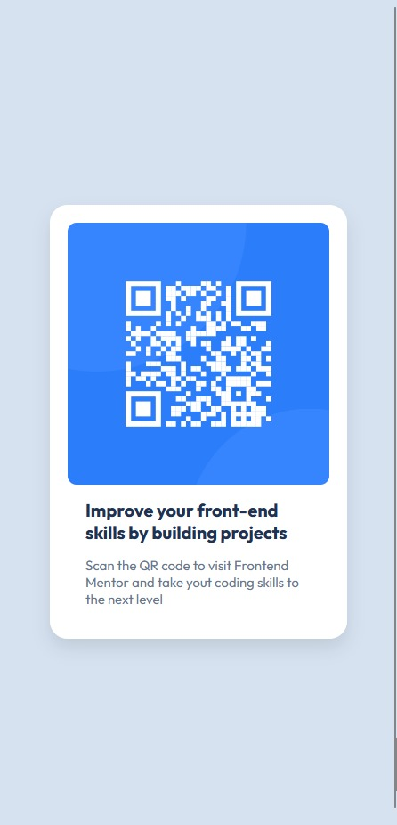

# QR Code Component Challenge

This is my solution to the **QR Code Component** challenge. It’s part of my journey to improve my frontend skills and get comfortable with HTML and CSS from scratch.

## 🚀 Overview

### Screenshot

### Links

- Live Site URL: [https://yourusername.github.io/project-folder](https://yourusername.github.io/project-folder)

## 💻 My process

### Built with

- Semantic HTML5 markup
- Modern CSS (Flexbox, Media Queries)
- Mobile-first workflow

### What I learned

This challenge helped me solidify the basics of:

- Using REM units for responsive design
- Centering elements with Flexbox
- Writing clean, reusable utility classes
- Working with media queries

### Continued development

I want to keep improving my layouts and responsive designs. I’ll move next to more complex components and layouts.

## Author

- GitHub: https://github.com/kolujAs

---

Feel free to use it or adapt it as inspiration!
